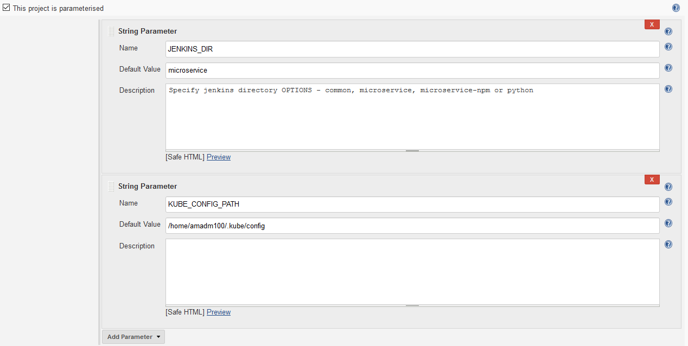
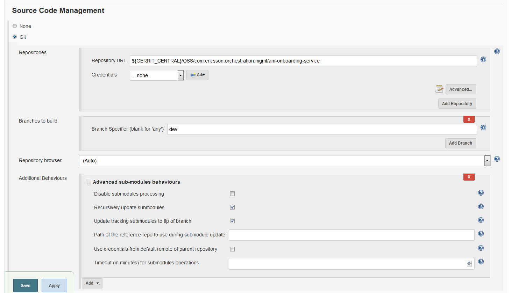
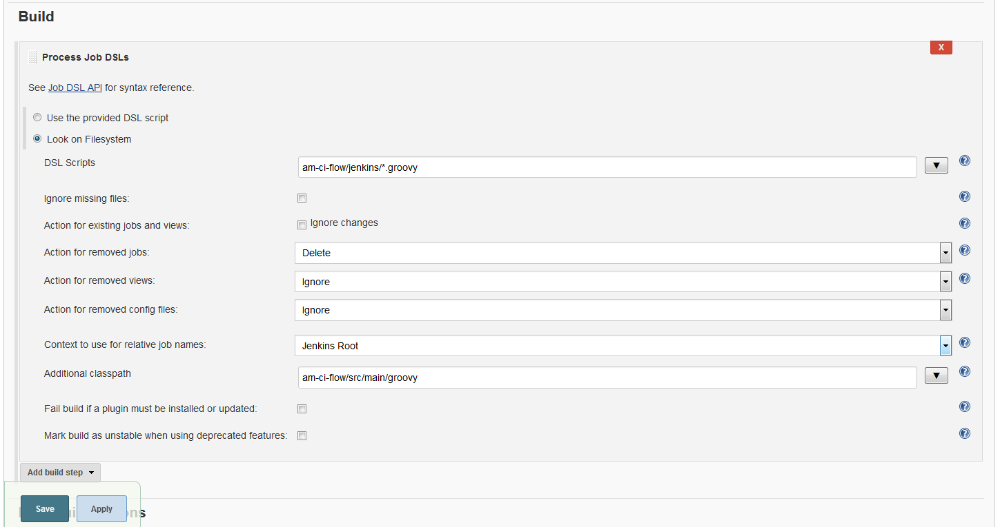
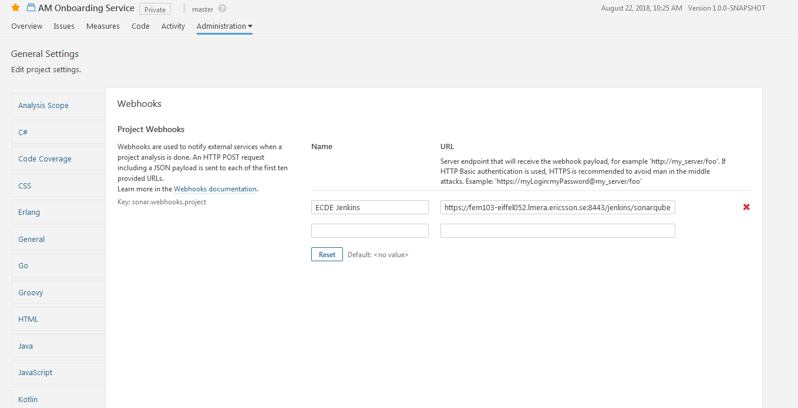

# Prerequisites

## Global Environment Variables
Note: The seed job expects some Global Environment Variables to be present on Jenkins

| Name | Value |
| ------------ | ----------------------------------------------- |
| *GERRIT_CENTRAL* | ssh://gerrit-gamma.gic.ericsson.se:29418 |
| *GERRIT_MIRROR* | ssh://gerrit-gamma-read.seli.gic.ericsson.se:29418 |
| *GERRIT_SSH_CENTRAL* | ssh://amadm100@ggerrit-gamma.gic.ericsson.se:29418 |
| *GERRIT_SSH_MIRROR* | ssh://amadm100@gerrit-gamma-read.seli.gic.ericsson.se:29418 |
| *GERRIT_URL* | https://gerrit-gamma.gic.ericsson.se |
| *GERRIT_HTTP_URL* | https://gerrit-gamma.gic.ericsson.se/a |
| *SSH_USER* | amadm100
| *GERRIT_PULL* | Dynamic value for pulling from Gerrit (GERRIT_CENTRAL, GERRIT_MIRROR, GERRIT_SSH_CENTRAL, GERRIT_SSH_MIRROR) |
| *GERRIT_PUSH* | Dynamic value for pushing from Gerrit (GERRIT_CENTRAL, GERRIT_SSH_CENTRAL) |

## Seed Job

The E-VNFM Jenkins is https://fem4s11-eiffel052.eiffel.gic.ericsson.se:8443/jenkins/
To get access to create jobs contact one of the committers to this repository.

In order to create all required jobs for our project
 - Manually create a freestyle job, the name will be used to create the view and other jobs.
 - Add am-ci-flow as a submodule to the project repository https://git-scm.com/book/en/v2/Git-Tools-Submodules
 - Check Box "This project is parameterised" and select String Parameter
 - Name = JENKINS_DIR
 - Values to Specify
   - microservice - this results in a full gerrit flow including build and deploy, and full release flow
   - common - static checks only, and simple release flow
   - common-helm - static copyright validation and simple helm chart release flow
   - integration - this results in a single release flow job designed for integration helm charts
   - python - this results in a ci flow for a python project
 - Name = KUBE_CONFIG_PATH
   - This is the path to a kube config file located on the slave that points to the cluster you wish to deploy to
 - Name = CLUSTER_BASE_URL
   - This is the base url path to the cluster that can be used for install commands
 - Name = BRANCH
   - this is the branch name to use in all repositories
   - defaults to master
   - This is so we can re-create the flow in case of a dropback fix

  


 - Edit the job configuration and scroll down the the "Source Control Management" section and enter the projects repo details. This will be used to generate the rest of the pipeline flows.
 - Add in "Additional Behaviours" the "Advanced sub-modules behaviours". Click the boxes for "Recursively update submodules" and "Update tracking submodules to tip of branch". This will allow getting the latest am-ci-flow repository


 
 - Scroll down to the "Build" section and add a "Process Job DSLs" build step
 - Select the "Look on Filesystem" option and paste the path to the jenkins jobs configurations "am-ci-flow/jenkins/*.groovy" in the "DSL Scripts" textbox.
 - Click on the "Advanced" button and paste "am-ci-flow//src/main/groovy" in the "Additional classpath" textbox

 
 - Save the configuration and run the job

Once the job runs it automatically creates all the required jobs for the project.

## SonarQube Webhooks for publishing to sonarqube server
  - In sonarqube go to Administration > General Setting > webhooks (Sonar version 6.7.5)
  - Add jenkins server url for webhooks i.e. <jenkins_url>/sonarqube-webhooks/

  

# FAQ

## PROXY if build fails with 403 HTTP error code or with ECONNRESET error code while NPM package manager tries to fetch resources from its registry
 Make sure maven has the following settings:
 ```xml
   <proxies>
     <proxy>
       <active>true</active>
       <protocol>https</protocol>
       <host>atproxy1.athtem.eei.ericsson.se</host>
       <port>3128</port>
       <nonProxyHosts>*.ericsson.se|localhost</nonProxyHosts>
     </proxy>
     <proxy>
       <id>optional</id>
       <active>true</active>
       <protocol>http</protocol>
       <host>atproxy1.athtem.eei.ericsson.se</host>
       <port>3128</port>
       <nonProxyHosts>*.ericsson.se|localhost</nonProxyHosts>
     </proxy>
   </proxies>
 ```

 ## Additional Environment variables
 If you want to load env variables or additional properties for project specific variables to any command
 If you create a file called *pipeline-variables.groovy*. This file can be used to create a environment variable
 to be used in the pipeline.
 i.e. env.TEST_VARIABLE="--set app.enabled=false"
